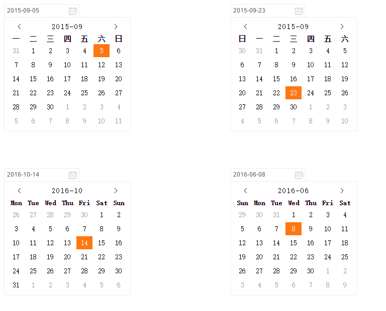

### datePicker 
a datepicker component for react

## Install

```bash
npm install react-easy-datepicker
```
## Usage

```js
var React = require('react');
var DatePicker = require('react-easy-datepicker');

React.render(
	<DatePicker />,
	document.getElementById('datePicker') 
);
```

## Options

### sundayFirst 
sunday is the first of the week

```js
React.render(
	<div>
		<div>
			<DatePicker style={{display:"inline-block"}}/>
			<DatePicker 
				sundayFirst="1" 
				style={{display:"inline-block",marginLeft: "300px"}}/>	
		</div>
		<div style={{marginTop: "300px"}}>
			<DatePicker 
				style={{display:"inline-block"}}
				days={["Mon","Tue","Wed","Thu","Fri","Sat","Sun"]}/>
			<DatePicker 
				style={{display:"inline-block",marginLeft: "300px"}}
				sundayFirst="1" 
				days={["Sun","Mon","Tue","Wed","Thu","Fri","Sat"]}/>
		</div>
	</div>,
	document.getElementById('datePicker') 
);
```

## ShortCut


